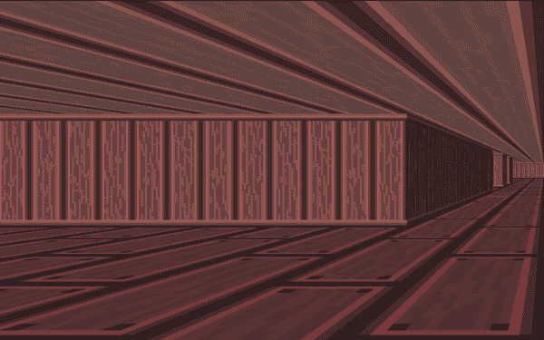

<H1 align="center">The Maze</H1>

## Background Context

The goal of this project is to create a game in 3D using raycasting !



> The decision to undertake this project was driven by a desire to engage in a challenging endeavor that would allow me to utilize and showcase my proficiency in the C programming language. I sought an opportunity to put my C skills to the test by creating a tangible and meaningful output. By embarking on this project, I aimed to explore the boundaries of what I could achieve using C and challenge myself to develop a substantial application.

### Links on RayCasting concept

- [SDL2 - Get started.pdf](https://intranet.alxswe.com/rltoken/pMnvq93vpbAh9q6inKQMuQ)
- [SDL2 tutorials](https://intranet.alxswe.com/rltoken/oona0Kd1yVyjHQGoJaV_aw)
- [RAYCASTING !!!](https://intranet.alxswe.com/rltoken/vRw7CP21mUmKFDdrQjQ2GA)
- [Alternative Raycasting Tutorial](https://intranet.alxswe.com/rltoken/dnQwzgrDUEhFXIF8sNivkg)

#### Compilation command

I have created a make file that compiles the source code and create one executable.

```
$ make maze
```

### Usage

After compiling using the make file just run:

```
$ ./bin/maze
```

or

```
$ cd bin
$./maze
```

To remove it run:

```
$ make clean
```

### Contributing

Contributions are always welcome!

### Related projects

- Sight and light [NICKY CASE]

For more insight:

> see: NICKY CASE
> [recommended](https://ncase.me/sight-and-light/)

I found HER content helpful.

AUTHOR

- Alvin Vaati
- email (alvinvaati@gmail.com)
- [Twitter](https://twitter.com/alvinvaati)
- [LinkedIN](https://www.linkedin.com/in/alvin-m-02aa93248)

LICENSE

<a href="https://creativecommons.org/publicdomain/zero/1.0/"></a>

To the extent possible under law, Alvin Vaati has waived all copyright and related or neighboring rights to this work.
